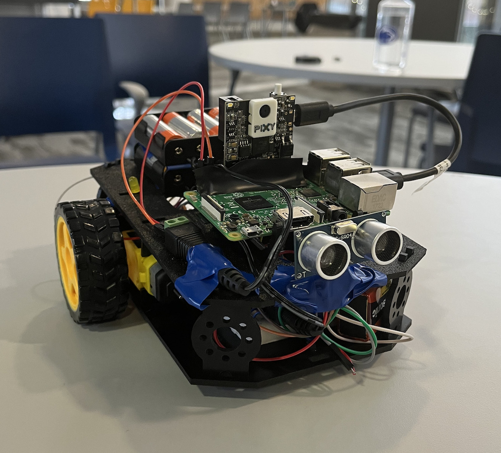
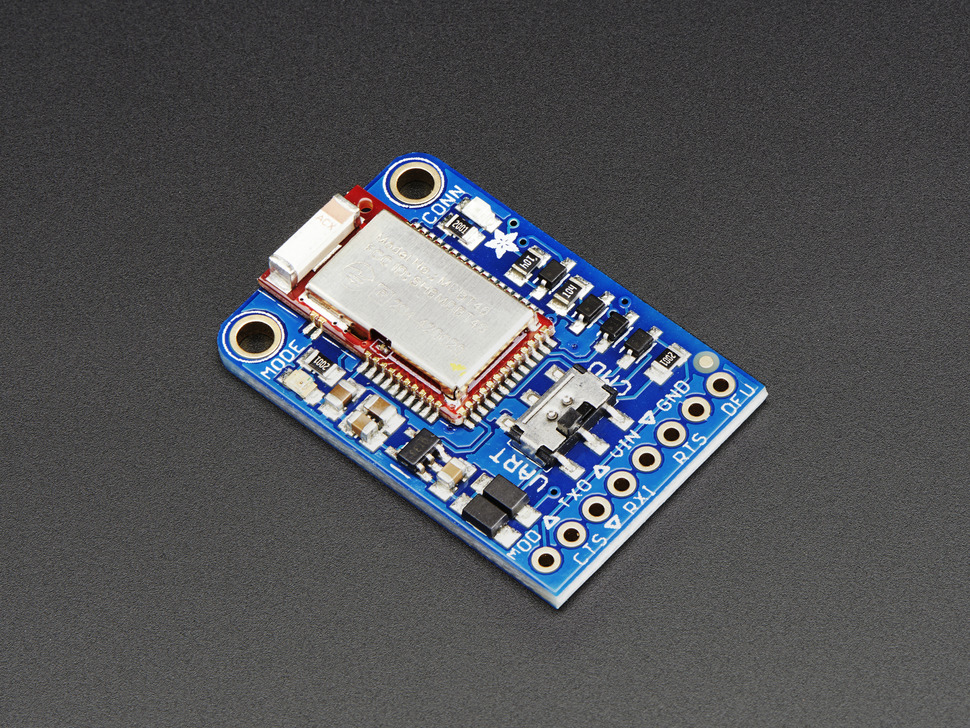
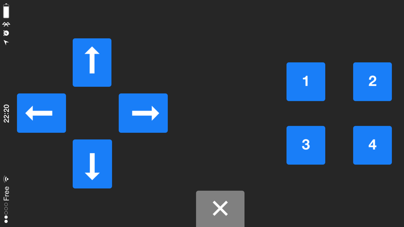
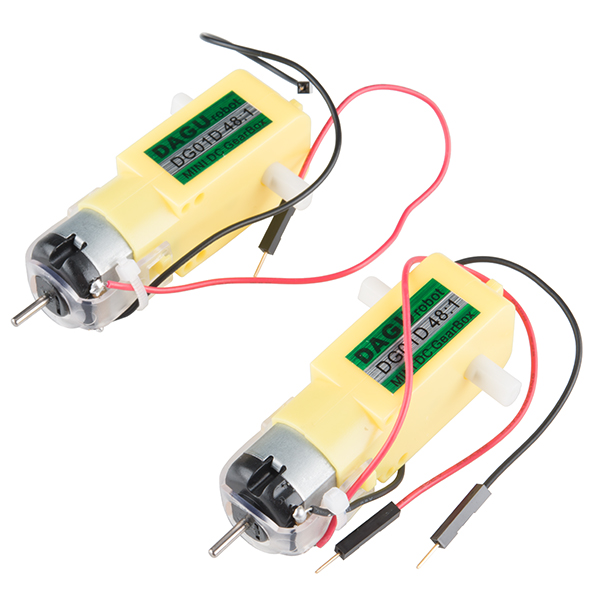
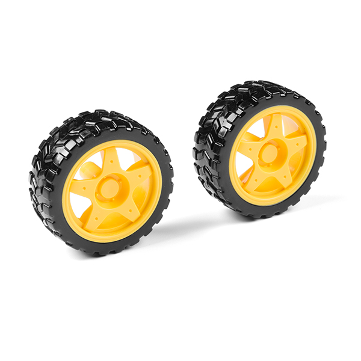
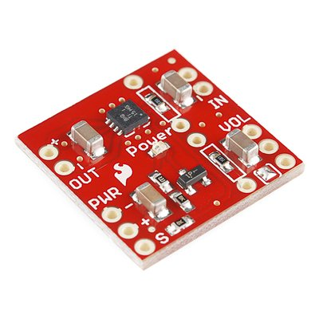
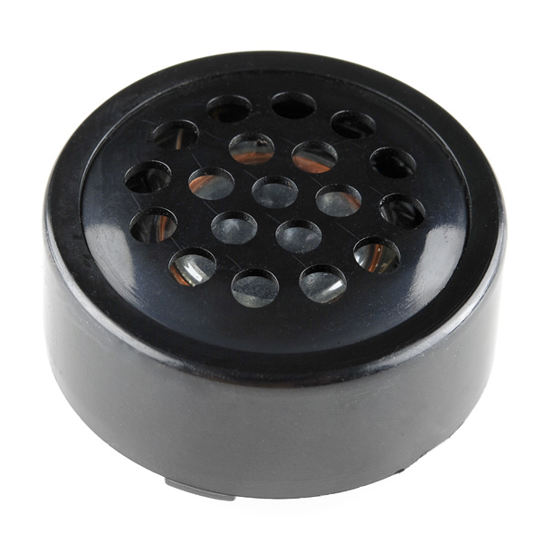
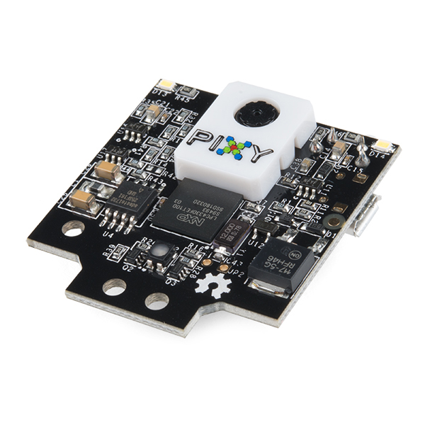
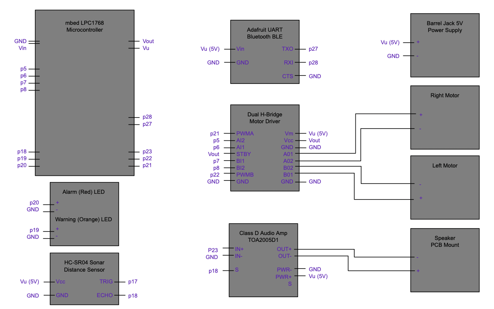

# Remote Controlled and Gesture Controlled  Car

## ECE 4180 Fall 2021 Final Project

##### Andrew Rocco, <arocco3@gatech.edu>
##### Dilip Paruchuri, <dparuchuri6@gatech.edu>
##### George Madathany, <gmadathany3@gatech.edu>
##### Thien Dinh-Do, <tdinhdo28@gatech.edu>



## Table of Contents
  - [Table of Contents](#table-of-contents)
  - [Introduction](#introduction)
  - [Parts Used](#parts-used)
  - [Assembly, Pinouts, and Implimentation](#assembly-pinouts-and-implimentation)
      - [Bluetooth Module](#bluetooth-module)
      - [Motor Module](#motor-module)
      - [Speaker Module](#speaker-module)
      - [Crash Detection Module](#crash-detection-module)
      - [Real-Time Video Footage Module](#real-time-video-footage-module)
      - [Overall Hardware Schematic](#overall-hardware-schematic)
  - [Code](#code)
  - [Instructions](#instructions)
    - [Main RC Car Build](#main-rc-car-build)
    - [Add-On Raspberry Pi Camera Feature](#add-on-raspberry-pi-camera-feature)
    - [User Guide](#user-guide)
  - [Demo](#demo)


## Introduction

We intend to develop a robotic car that can be operated in two ways: **remote control** and **gesture control**. The remote control will be through an iPhone app that will be transmitting data wirelessly to the mbed on the robotic car. We will be using the control pad of the iphone app to send the following commands: `forward`, `reverse`, `right`, `left`, and `stop`. The gesture control will also be established in the same iPhone app. The iPhone app isA able to take accelerometer data measurements, and we will be sending that data to the robotic car through bluetooth, and based on the change in accelerometer data, the car will move. An additional feature we will add is crash detection. The robotic car wil sound an alarm and light and LED when it gets too close to an object. An additional feature we will add is by using a raspberry pi and a raspberry pi camera, we will add OpenCV object detection as the robotic car is controlled.


## Parts Used

- [mbed NXP LPC1768 Microcontroller (Cortex-M3)](https://www.sparkfun.com/products/9564)
    > The Mbed is a platform for IoT (Internet of Things) devices. It contains a 32-bit ARM core, and is similar to an arduino microcontroller. Mbed contains an online operating system and compiler that lets users program and create embedded systems projects. Users can interface various I/O peripherals to the Mbed. The input and outputs can fall in wide range such as digital inputs, digital outputs, analog inputs, analog outputs, and pulse width modulation (PWM) signals.
- [Shadow Chassis](https://www.sparkfun.com/products/13301)
    > The Shadow Chassis is a robotic car frame that comes with the Mbed parts kit. Georgia Tech students are required to purchase two parts kits throughout their curriculum: a basic parts kit for ECE 2035 and an extension parts kit for ECE 4180. The extension pack includes the shadow chassis. The shadow chassis when put together can support two motors connected to wheels, battery pack, microcontroller, and a breadboard.
- [Hobby Gearmotor - 140 RPM (Pair)](https://www.sparkfun.com/products/13302)
    > The gearmotors are utilized to turn the wheels of the RC car. The gear ratio of the motors are 48:1 which means they provide a large mechanical advantage. The Mbed alone cannot be directly interfaced with the motors. The mbed will be interfaced to the motors through a Dual H-Bridge which will allow the mbed to control both the speed and direction of both motors at the same time.
- [Wheel - 65mm (Rubber Tire, Pair)](https://www.sparkfun.com/products/13259)
- [Motor Driver - Dual TB6612FNG](https://www.sparkfun.com/products/14450)
    > A motor driver or Dual H-bridge is a chip that allow for a microcontroller like the mbed to control both the speed and direction of a motor. Normally, a microcontroller can not do that, but the h-bridge contains a fwd and rev signal for each motor along with a PWM signal to set the speed. More importantly this motor driver can be interfaced with two motors.
- [Adafruit Bluefruit LE UART Friend - Bluetooth Low Energy (BLE)](https://www.adafruit.com/product/2479)
    > The bluetooth module is utilized for wireless communication and control of the RC car utilizing the Adafruit app from the app store. In this project, the app will be used for the control pad which will allow for the user to control the RC car with the standard forward, right, left, back, and stop buttons. Also, the app will be used for its accelerometer readings which will be transmitted to the mbed for the gesture control aspect of the project.
- [Mono Audio Amp Breakout - TPA2005D1](https://www.sparkfun.com/)
    > The Class D Audio Amplifier is also an interface chip that is connected between the mbed and a speaker. The amplifier allows for a lower voltage graw as it only takes 3.3V for power. Moreover, it offers extra control over the speaker such as volume adjustment.
- [Speaker - PCB Mount](https://www.sparkfun.com/products/11089)
    > The speaker is an output device that has the ability to play wav files as well as audio samples loaded into the mbed. The speaker is relatively simple to use, and can be used without the amplifier, however it is best, when connected to the amplifier. The speaker is one of the components that is best used through and interrupt function in the code.
- [Ultrasonic Distance Sencsor - HC-SR04](https://www.sparkfun.com/products/15569)
    > This sensor measures the distance from the face of the sensor to the nearest object. The sensor is able to pick up objects up to 1 m away. It works by sending and sending out a sound wave and measures the distance from the wave that returns. It is not the most accurate sensor, however for the purposes of the project, it suffices.
- [LED - Basic Color 5mm](https://www.sparkfun.com/products/9590)
    > LEDs are one of the most simple yet versatile components that is available for embedded systems design. It can be utilized for quick testing and error checking, as well as in the case of the project, as a signal to indicate a message.
- [Wall Adapter Power Supply - 5VDC 2A](https://www.sparkfun.com/products/15312)
- [DC Barrel Jack Adapter](https://www.sparkfun.com/products/10811)
- [Raspberry Pi 3 B+](https://www.sparkfun.com/products/14643)
- [Pixy2 CMUcam5](https://www.sparkfun.com/products/14678)


## Assembly, Pinouts, and Implimentation

Below are the important modules and their respective pinouts to the fucntionality of this project. Each are followed by a template or basic implimentation in `C++` code:

#### Bluetooth Module

<!--  --> 
<!--  -->
 

| mbed LPC1768 | Adafruit LE UART BLE |
| :---: | :---: |
| GND | CTS |
| p27 (Serial RX) | TXO |
| p28 (Serial TX) | RXI |
| Vu (5V) | Vin |
| GND | GND |

<!-- mbed	Adafruit BLE
gnd	gnd
VU(5v)	Vin (3.3-16V)
nc	RTS
Gnd	CTS
p27 (Serial RX)	TXO
p28 (Serial TX)	RXI -->

[Code](https://os.mbed.com/users/4180_1/notebook/adafruit-bluefruit-le-uart-friend---bluetooth-low-/) below is useful for **remote control mode**:
```c++
#include "mbed.h"
BusOut myled(LED1,LED2,LED3,LED4);
Serial blue(p28,p27);
int main()
{
    char bnum=0;
    while(1) {
        if (blue.getc()=='!') {
            if (blue.getc()=='B') { //button data
                bnum = blue.getc(); //button number
                if ((bnum>='1')&&(bnum<='4')) //is a number button 1...4
                    myled[bnum-'1']=blue.getc()-'0'; //turn on/off that num LED
            }
        }
    }
}
```
[Code](https://os.mbed.com/users/4180_1/notebook/adafruit-bluefruit-le-uart-friend---bluetooth-low-/) below is useful for **gesture control mode**:
```c++
#include "mbed.h"
Serial bluemod(p28,p27);
PwmOut left_led(LED1);
PwmOut right_led(LED4);
PwmOut forward_led(LED2);
PwmOut reverse_led(LED3);
 
//C union can convert 4 chars to a float - puts them in same location in memory
//trick to pack the 4 bytes from Bluetooth serial port back into a 32-bit float
union f_or_char {
    float f;
    char  c[4];
};
 
int main()
{
    char bchecksum=0;
    char temp=0;
    union f_or_char x,y,z;
    while(1) {
        bchecksum=0;
        if (bluemod.getc()=='!') {
            if (bluemod.getc()=='A') { //Accelerometer data packet
                for (int i=0; i<4; i++) {
                    temp = bluemod.getc();
                    x.c[i] = temp;
                    bchecksum = bchecksum + temp;
                }
                for (int i=0; i<4; i++) {
                    temp = bluemod.getc();
                    y.c[i] = temp;
                    bchecksum = bchecksum + temp;
                }
                for (int i=0; i<4; i++) {
                    temp = bluemod.getc();
                    z.c[i] = temp;
                    bchecksum = bchecksum + temp;
                }
                if (bluemod.getc()==char(~('!' + 'A' + bchecksum))) { //checksum OK?
                    //printf("X = %f  Y = %f  Z = %f\n\r",x.f, y.f, z.f);
                    right_led = left_led = forward_led = reverse_led = 0.0;
                    if (x.f<=0.0) right_led = -x.f/10.0;//Scale to 0.0 to 1.0 for PWM so /10.0
                    else left_led = x.f/10.0;
                    if (y.f<=0.0) forward_led = -y.f/10.0;
                    else reverse_led = y.f/10.0;
                }
            }
        }
    }
}
```

#### Motor Module

<!--  -->
<!--  -->
<!--  -->
  

| mbed LPC1768 | H-Bridge Motor Driver | Motor |
| :---: | :---: | :---: |
| Vu (5V) | VM |  |
| Vout | Vcc |  |
| GND | GND |  |
|  | A01 | R+ |
|  | A02 | R- |
|  | B02 | L- |
|  | B01 | L+ |
| GND | GND |  |
| p21 | PWMA |  |
| p5 | AI2 |  |
| p6 | AI1 |  |
| Vout | STBY |  |
| p7 | BI1 |  |
| p8 | BI2 |  |
| p22 | PWMB |  |
| GND | GND |  |

[Code](https://os.mbed.com/cookbook/Motor) below is useful for **two motor systems**:
```c++
// test code, this demonstrates working motor drivers. 
// full reverse to full stop, dynamicaly brake and switch off.
#include motordriver.h
Motor A(p22, p6, p5, 1); // pwm, fwd, rev, can brake 
Motor B(p21, p7, p8, 1); // pwm, fwd, rev, can brake
int main() {
    for (float s= -1.0; s < 1.0 ; s += 0.01) {
        A.speed(s); 
        B.speed(s); 
        wait(0.02);
    }
    A.stop();
    B.stop();
    wait(1);
    A.coast();
    B.coast();
}
```

#### Speaker Module

<!--  -->
<!--  -->
  

| mbed LPC1768 | Class D Audio Amp TOA2005D1 | Speaker |
| :---: | :---: | :---: |
|  | OUT+ | + |
|  | OUT- | - |
| GND | PWR- |  |
| Vu (5V) | PWR+ |  |
|  | S |  |
| p23 | IN+ |  |
| GND | IN- |  |
<!-- | p18 | VOL |  | -->

<!-- mbed	TPA2005D1	Speaker
gnd	pwr - (gnd), in -	
Vout (3.3V) or 5V	pwr +	
p26 (any PWM or D/A)	in +	
out +	+
out -	-	
Any DigitalOut px(optional)	S (low for shutdown)	 -->

[Code](https://os.mbed.com/users/4180_1/notebook/using-a-speaker-for-audio-output/) below is useful for **speaker interrupts**:
```c++
#include "mbed.h"
// Audio output demo for speaker
// generates a 500Hz sine wave on the analog output pin
// 128 data points on one sine wave cycle are precomputed,
// scaled, stored in an array and
// continuously output to the Digital to Analog convertor
 
AnalogOut DAC(p18);
//global variables used by interrupt routine
volatile int i=0;
float Analog_out_data[128];
 
// Interrupt routine
// used to output next analog sample whenever a timer interrupt occurs
void Sample_timer_interrupt(void)
{
    // send next analog sample out to D to A
    DAC = Analog_out_data[i];
    // increment pointer and wrap around back to 0 at 128
    i = (i+1) & 0x07F;
}
 
int main()
{
    // set up a timer to be used for sample rate interrupts
    Ticker Sample_Period;
    // precompute 128 sample points on one sine wave cycle 
    // used for continuous sine wave output later
    for(int k=0; k<128; k++) {
        Analog_out_data[k]=((1.0 + sin((float(k)/128.0*6.28318530717959)))/2.0);
        // scale the sine wave from 0.0 to 1.0 - as needed for AnalogOut arg 
    }
    // turn on timer interrupts to start sine wave output
    // sample rate is 500Hz with 128 samples per cycle on sine wave
    Sample_Period.attach(&Sample_timer_interrupt, 1.0/(500.0*128));
    // everything else needed is already being done by the interrupt routine
    while(1) {}
}
```

#### Crash Detection Module

<!--  --> 


| mbed LPC1768 | HC-SR04 Distance Sensor |
| :---: | :---: |
| Vu (5V) | Vcc |
| p17 | TRIG |
| p18 | ECHO |
| GND | GND |

<!-- mbed LPC1768	HC-SR04
Vu (5V)	Vcc
Gnd	Gnd
p6	trig
p7	echo -->

[Code](https://os.mbed.com/users/4180_1/notebook/using-the-hc-sr04-sonar-sensor/) below is useful for **distance sensing using timers**:
```c++
#include "mbed.h"
#include "ultrasonic.h"
 
 void dist(int distance)
{
    //put code here to execute when the distance has changed
    printf("Distance %d mm\r\n", distance);
}
 
ultrasonic mu(p6, p7, .1, 1, &dist);    //Set the trigger pin to p6 and the echo pin to p7
                                        //have updates every .1 seconds and a timeout after 1
                                        //second, and call dist when the distance changes
 
int main()
{
    mu.startUpdates();//start measuring the distance
    while(1)
    {
        //Do something else here
        mu.checkDistance();     //call checkDistance() as much as possible, as this is where
                                //the class checks if dist needs to be called.
    }
}
```

#### Real-Time Video Footage Module

  

| Raspberry Pi 3 | Pixy2 CMUcam5 |
| :---: | :---: |
| USB2.0 Port | Micro USB |


#### Overall Hardware Schematic




## Instructions

Below are instructions on how to build this project through software:

#### Main RC Car Build

1. Sign into the online mbed compiler and create a new blank project.
2. [Download or copy](https://github.com/thiendinhdo/thiendinhdo.github.io/blob/main/main.cpp) the following code into the online mbed compiler.
3. Once that `main.cpp` file is correctly written, go to the respective sites and copy/import the following libraries into the project. If need be, import a pre-existing project into your compiler, and then copy and paste the library into your working project.
   - [PinDetect](https://os.mbed.com/users/4180_1/notebook/pushbuttons/) 
   - [Motor](https://os.mbed.com/cookbook/Motor) 
   - [HC_SR04_Ultrasonic_Library](https://developer.mbed.org/users/4180_1/notebook/using-the-hc-sr04-sonar-sensor/) 
   - [mbed-rtos](https://os.mbed.com/handbook/RTOS) 
4. Ensure that all libraryies are imported and the build and compile the project (`Cmd-D` o r `Ctrl-D`).
5. Connect the mbed and drag and drop the downloaded `.bin` file into the mbed folder.

#### Add-On Raspberry Pi Camera Feature

1. Connect your Raspberry Pi 3 to a monitor and launch **terminal**.

#### User Guide


## Code 

Below is the code used in the project, integrating the templates of the important modules listed above to the desired controls:

```c++
#include "mbed.h"
#include "Motor.h"
#include "PinDetect.h"
#include "rtos.h"
#include "ultrasonic.h"


Serial blue(p28,p27);       //UART
Motor right(p21, p6, p5);  // pwm, fwd, rev
Motor left(p22, p8, p7);   // pwm, fwd, rev

DigitalOut led1(LED1);

DigitalOut led2(LED2);
DigitalOut led3(LED3);

DigitalOut bluetoothMode(p15);
DigitalOut gestureMode(p16);

PinDetect pb(p10);

Serial pc(USBTX, USBRX);

DigitalOut warningLED(p19);
DigitalOut alarmLED(p20);
PwmOut speaker(p23);

Thread thread1;

//negative is fwd for the car

union f_or_char {
    float f;
    char  c[4];
};

bool isBluetooth = true;
bool isGesture = false;

void pb_hit_callback (void) {
    bluetoothMode = !bluetoothMode;
    gestureMode = !gestureMode;
    
    isBluetooth = !isBluetooth;
    isGesture = !isGesture;  
    
    if (isBluetooth)
    {
        led2 = 1;
    }
    else
    {
        led2 = 0;
    }
    
    if (isGesture)
    {
        led3 = 1;
    }
    else
    {
        led3 = 0;
    }
        
        
}
  
void uart_thread()
{
    char bchecksum=0;
    char temp=0;
    union f_or_char x,y,z;
   
    char bnum=0;
    char bhit=0;
    
    while(1) {
        
        if (isGesture)
        {
            bchecksum=0;
            if (blue.getc()=='!') {
                if (blue.getc()=='A') { //Accelerometer data packet
                    for (int i=0; i<4; i++) {
                        temp = blue.getc();
                        x.c[i] = temp;
                        bchecksum = bchecksum + temp;
                    }
                    for (int i=0; i<4; i++) {
                        temp = blue.getc();
                        y.c[i] = temp;
                        bchecksum = bchecksum + temp;
                    }
                    for (int i=0; i<4; i++) {
                        temp = blue.getc();
                        z.c[i] = temp;
                        bchecksum = bchecksum + temp;
                    }
                    if (blue.getc()==char(~('!' + 'A' + bchecksum))) { //checksum OK?
                        pc.printf("X = %f  Y = %f  Z = %f\n\r",x.f, y.f, z.f);
                        
                        if ((abs(x.f) < 0.25) && (abs(y.f) < 0.25))
                        {
                            pc.printf("STOP\r\n");
                            left.speed(0);
                            right.speed(0);
                        }
                        else if (x.f >= 0.25)
                        {
                            pc.printf("RIGHT\r\n");
                            left.speed(-0.5);
                            right.speed(0);
                        }
                        else if (x.f <= -0.25)
                        {
                            pc.printf("LEFT\r\n");
                            left.speed(0);
                            right.speed(-0.5);
                        }
                        else if (y.f >= 0.25)
                        {
                            pc.printf("FORWARD\r\n");
                            left.speed(-0.5);
                            right.speed(-0.5);
                        }
                        else if (y.f <= -0.25)
                        {
                            pc.printf("BACKWARD\r\n");
                            left.speed(0.5);
                            right.speed(0.5);
                        }
 
                    }
                }
            }
        }
        
        if (isBluetooth)
        {

            if (blue.getc()=='!') {
                if (blue.getc()=='B') { //button data packet
                    bnum = blue.getc(); //button number
                    bhit = blue.getc(); //1=hitt, 0=release
                    if (blue.getc()==char(~('!' + 'B' + bnum + bhit))) { //checksum OK?
                        switch (bnum) {
                            case '5': //button 5 up arrow
                                if (bhit=='1') {
                                    pc.printf("FORWARD\r\n");
                                    left.speed(-0.5);
                                    right.speed(-0.5);
                                } else {
                                    pc.printf("STOP\r\n");
                                    right.speed(0);
                                    left.speed(0);
                                }
                                break;
                            case '6': //button 6 down arrow
                                if (bhit=='1') {
                                    pc.printf("BACKWARD\r\n");
                                    left.speed(0.5);
                                    right.speed(0.5);
                                } else {
                                    pc.printf("STOP\r\n");
                                    right.speed(0);
                                    left.speed(0);
                                }
                                break;
                            case '7': //button 7 left arrow
                                if (bhit=='1') {
                                    pc.printf("LEFT\r\n");
                                    left.speed(0);
                                    right.speed(-0.5);
                                } else {
                                    pc.printf("STOP\r\n");
                                    right.speed(0);
                                    left.speed(0);
                                }
                                break;
                            case '8': //button 8 right arrow
                                if (bhit=='1') {
                                    pc.printf("RIGHT\r\n");
                                    left.speed(-0.5);
                                    right.speed(0);
                                } else {
                                    pc.printf("STOP\r\n");
                                    right.speed(0);
                                    left.speed(0);
                                }
                                break;
                            default:
                                break;
                        }
                    }
                }
            }
        }
    }
}

void dist(int distance)
{
    //put code here to execute when the distance has changed
    //pc.printf("Distance %d mm\r\n", distance);
    float note = 0;
    switch (distance/100) {
        case 0:
            note = (1.0f/440.0f);
            //speaker.period(note);
            //speaker = 0.1;
            alarmLED = 1;
            warningLED = 0;
            break;
        case 1:
            note = (1.0f/260.0f);
            //speaker.period(note);
            //speaker = 0.1;
            alarmLED = 0;
            warningLED = 1;
            break;
        default:
            note = 0;
            //speaker.period(note);
            //speaker = 0;
            alarmLED = 0;
            warningLED = 0;
            break;
    }
    if (note == 0)
        speaker = 0;
    else { 
        speaker.period(note);
        speaker = 0.1;
    }
   
}

ultrasonic mu(p17, p18, .1, 1, &dist);  //Set the trigger pin to p17 and the echo pin to p18
                                        //have updates every .1 seconds and a timeout after 1
                                        //second, and call dist when the distance changes
  
int main()
{
    bluetoothMode = 1;
    gestureMode = 0;
    
    
    led1 = 1;
    led2 = 1;
    led3 = 0;
    
    pb.mode(PullUp);
    pb.attach_deasserted(&pb_hit_callback);
    pb.setSampleFrequency();

    alarmLED = 1;
    warningLED = 1;
    wait(3);
    alarmLED = 0;
    warningLED = 0;
    
    thread1.start(uart_thread);
    
    // while(1)
    // {
    //     led1 = !led1;
    //     wait(0.5);
    // }

    mu.startUpdates();//start measuring the distance
    while(1)
    {
        //Do something else here
        mu.checkDistance();     //call checkDistance() as much as possible, as this is where
                                //the class checks if dist needs to be called.
        Thread::wait(100);  // delay by .1 seconds
    }
    
    
} 
```

## Demo

Click [here](https://www.youtube.com/watch?v=IDjmc81H-Uw) for the demo video.

Click [here](https://docs.google.com/presentation/d/10F8vILMPrhSeKc8hGtMochFeFNvN3BIfHhVTrCbt-NI/edit?usp=sharing) for the presenation slides.
